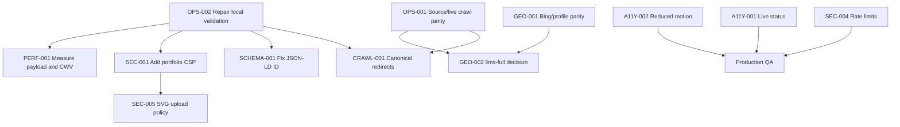

# Phase E - Final Audit Report And Remediation Plan

## Executive Summary

The portfolio is technically strong: data-driven, SSR/prerendered, schema-rich, CMS-protected, and closely connected to the blog. The main production risks are not catastrophic breakages. They are consistency and hardening gaps:

- Live crawl artifacts are partly outside the current source, so deploy reproducibility is weak.
- Canonical URL variants return 200 instead of redirecting.
- Portfolio GEO endpoints lag behind the blog and do not exactly match current blog entity/content facts.
- One live case-study JSON-LD node has a malformed `#person` reference.
- Portfolio pages lack CSP while the blog has one.
- Local validation cannot run because the dependency/toolchain install is incomplete.

No live 5xx, deindexing directive, hard 404 in sitemap, or CMS exposure was confirmed.

## Master Issue Tracker

| ID | Severity | Confidence | Category | Affected URLs | Primary Evidence | Owner |
|---|---|---|---|---|---|---|
| `OPS-001` | Medium | Verified | Deployment parity | `/robots.txt`, `/sitemap.xml`, `/sitemap-portfolio.xml` | Live sitemap index not reproducible from `src/app/sitemap.ts` | DevOps/Next.js |
| `CRAWL-001` | Medium | Verified | Crawl/canonical | `/case-studies`, `/case-studies/*`, `/search` | Slash and non-slash variants return 200; mixed source links | Next.js/SEO |
| `SCHEMA-001` | Medium | Verified | Structured data | `/case-studies/udemy-enroller-fastapi/` | Runtime JSON-LD has `https://madhudadi.in//#person`; source line 219 | Next.js/SEO |
| `GEO-001` | Medium | Verified | GEO/content | `/ai-profile.json`, `/llms.txt`, `/blog/ai-profile.json` | Portfolio updated 2026-05-03, blog updated 2026-05-19 | SEO/GEO |
| `GEO-002` | Low | Verified | GEO/discovery | `/llms-full.txt` | Live robots allows root file; root returns 404 | SEO/DevOps |
| `PERF-001` | Medium | Inferred | Performance | `/`, portfolio pages | Home decoded HTML 504825 bytes; source `inlineCss` enabled | Frontend |
| `OPS-002` | Medium | Verified | Validation | Local workspace | pnpm missing, Biome/Next dependency resolution fails | DevOps |
| `SEC-001` | Medium | Verified | Security headers | Portfolio pages | Portfolio lacks CSP; blog has CSP | Security/Frontend |
| `SEC-002` | Low | Verified | Info disclosure | Portfolio pages | `x-powered-by: Next.js` present | Frontend |
| `SEC-003` | Medium | Verified | Email injection | Contact form | Contact email escapes message only, not name/email/subject | Backend |
| `SEC-004` | Medium | Inferred | Abuse/rate limit | `/api/chat`, contact action | Public API/action has no source-level rate limiting | Backend/Edge |
| `SEC-005` | Medium | Inferred | Upload safety | `/api/cms/upload`, `/uploads/cms/*` | SVG upload allowed to public same-origin directory | Backend/Security |
| `A11Y-001` | Low | Verified | Accessibility | Contact form | Status div lacks live region | Frontend |
| `A11Y-002` | Low | Verified source | Accessibility | Interactive UI | Motion guards partial | Frontend |

## Verified Findings

`OPS-001`, `CRAWL-001`, `SCHEMA-001`, `GEO-001`, `GEO-002`, `OPS-002`, `SEC-001`, `SEC-002`, `SEC-003`, `A11Y-001`, `A11Y-002`

## Inferred Findings

`PERF-001`, `SEC-004`, `SEC-005`

## Needs External Validation

- Core Web Vitals field verdict: CrUX, Search Console, or RUM required.
- Search indexing state: Search Console URL Inspection and Coverage required.
- CDN/WAF/rate-limit controls: Cloudflare/production config required.
- Browser accessibility and keyboard behavior: browser and screen reader testing required.
- Rich result eligibility: Google Rich Results Test and Schema.org validator required.

## Fix Dependency Graph

## Implementation Checklist

- Repair package manager/dependency install.
- Re-run lint, tests, build.
- Decide whether root sitemap/robots composition belongs in this repo or deployment config.
- Add source-controlled route or config for `sitemap-portfolio.xml` if it remains live.
- Normalize internal links to canonical URLs.
- Add redirects for noncanonical trailing-slash variants or remove `skipTrailingSlashRedirect`.
- Fix case-study JSON-LD author ID.
- Sync root AI profile and LLM feed with blog content/entity fields.
- Resolve root `/llms-full.txt` mismatch.
- Add portfolio CSP.
- Disable `X-Powered-By`.
- Escape all contact email fields.
- Add app/edge rate limiting for chat and contact.
- Disable or sanitize SVG uploads.
- Add contact form live region.
- Add reduced-motion guards.
- Measure performance with Lighthouse and field data.

## File-Level Remediation Plan

| File | Issues | Change |
|---|---|---|
| `package.json` / environment | `OPS-002` | Ensure pnpm/Corepack install path works; reinstall dependencies |
| `next.config.ts` | `CRAWL-001`, `SEC-001`, `SEC-002`, `PERF-001` | Revisit slash redirects, add CSP, set `poweredByHeader: false`, test `inlineCss` |
| `src/app/sitemap.ts` | `OPS-001`, `CRAWL-001` | Remove noncanonical `/search` or align canonical; decide sitemap-index strategy |
| `src/app/robots.ts` | `OPS-001`, `GEO-002` | Align source with live robots and root LLM endpoint policy |
| `src/app/llms.txt/route.ts` | `GEO-001`, `GEO-002` | Include current blog facts and optional full endpoint link only if valid |
| `src/app/ai-profile.json/route.ts` | `GEO-001` | Import/normalize blog profile stats, roles, focus areas, latest posts |
| `src/app/(portfolio)/case-studies/[slug]/page.tsx` | `SCHEMA-001`, `CRAWL-001` | Fix `` `${siteUrl}/#person` `` to `` `${siteUrl}#person` ``; canonicalize links |
| `src/components/sections/QuickAnswersSection.tsx` | `CRAWL-001` | Link `/case-studies/` |
| `src/app/actions/submit-contact-form.ts` | `SEC-003`, `SEC-004` | Escape all fields; add throttling integration |
| `src/app/api/chat/route.ts` | `SEC-004` | Add rate limiting and abuse telemetry |
| `src/app/api/cms/upload/route.ts` | `SEC-005` | Remove SVG or sanitize/rasterize |
| `src/components/sections/ContactForm.tsx` | `A11Y-001` | Add live region and result focus handling |
| `src/components/SidebarToggle.tsx` | `A11Y-002` | Add `motion-reduce` classes |
| `src/components/FloatingDockClient.tsx` | `A11Y-002` | Add `motion-reduce` classes |
| `src/components/sections/ProfileImage.tsx` | `A11Y-002` | Disable pulse/ping/scale for reduced motion |
| `src/app/globals.css` | `A11Y-002` | Add global reduced-motion fallback |

## Runtime Validation Checklist

- `curl -I https://madhudadi.in/case-studies` returns 308/301 to `/case-studies/`.
- `curl -I https://madhudadi.in/case-studies/udemy-enroller-fastapi` returns 308/301 to slash URL.
- `curl -I https://madhudadi.in/search` matches chosen canonical policy.
- `curl -I https://madhudadi.in/llms-full.txt` returns 200 if advertised, or robots no longer advertises it.
- `curl -I https://madhudadi.in/` includes CSP and omits `x-powered-by`.
- `/cms` and `/api/cms/content` still return 401 unauthenticated.
- `/api/chat` rejects malformed input and rate-limits repeated valid POSTs.
- Contact form result is visible and screen-reader announced.

## SEO Validation Checklist

- Re-submit sitemap in Search Console.
- URL Inspection for `/`, `/case-studies/`, both case studies, `/search`, `/blog`.
- Confirm sitemap URLs are canonical and 200.
- Confirm no sitemap URL is noindex.
- Confirm redirects preserve query strings only where intended.
- Run Rich Results Test for home and case-study pages.
- Validate metadata and OG/Twitter cards after deployment.

## GEO/AEO Validation Checklist

- Diff `/ai-profile.json` and `/blog/ai-profile.json` shared entity fields.
- Diff `/llms.txt` and `/blog/llms.txt` author/entity sections.
- Confirm root AI profile includes blog post count, series count, tag count, latest update date, and current canonical blog topics.
- Confirm robots includes current official crawler tokens intentionally. OpenAI docs identify `OAI-SearchBot`, `GPTBot`, and `ChatGPT-User`; Google docs identify `Google-Extended`.
- Test ChatGPT/Perplexity/Gemini retrieval manually after re-crawl where possible.

## Security Hardening Checklist

- Add CSP with reporting first, then enforce.
- Disable `x-powered-by`.
- Escape all contact email fields.
- Add rate limiting to chat and contact.
- Add request size limits where not already enforced.
- Remove or sanitize SVG uploads.
- Keep CMS Basic Auth and `Cache-Control: no-store`.
- Add dependency audit once package manager works.
- Review source map exposure policy in production.
- Document Cloudflare WAF/rate-limit rules.

## Accessibility Remediation Checklist

- Add `role="status"` or `role="alert"` to contact result messages.
- Add reduced-motion global CSS and component variants.
- Run keyboard-only navigation over home, chat, dock, contact form, case studies, and blog transition links.
- Run axe/Lighthouse accessibility scans.
- Check focus order and focus visibility in dark and light themes.
- Screen reader smoke test contact form, chat open/close, floating navigation, and status messages.

## Performance Optimization Roadmap

Quick wins:

- Repair build tooling.
- Run Lighthouse baseline.
- Test CSP without blocking current assets.
- Canonical redirect cleanup to reduce duplicate crawl work.

Medium term:

- Measure `inlineCss` impact against HTML bytes and LCP.
- Audit DOM node count and below-the-fold SSR weight.
- Add bundle analyzer after dependency repair.

Advanced:

- Add RUM/web-vitals reporting.
- Add performance budgets in CI.
- Add synthetic monitoring for portfolio and blog parity endpoints.

## Production Rollout Plan

1. Repair local validation and confirm clean `pnpm lint`, `pnpm test`, `pnpm build`.
2. Ship low-risk fixes first: `SCHEMA-001`, `A11Y-001`, `SEC-002`, internal canonical links.
3. Ship sitemap/robots/canonical redirect changes together.
4. Submit sitemap and inspect URLs in Search Console.
5. Ship GEO parity updates and verify root/blog endpoint diffs.
6. Add CSP in report-only mode.
7. Review CSP reports, then enforce.
8. Add rate limiting and upload hardening.
9. Run Lighthouse, axe, and manual keyboard QA.
10. Monitor logs, Search Console, and AI retrieval behavior.

## QA Validation Matrix

| Area | Test | Tool | Pass Criteria |
|---|---|---|---|
| Build | Production build | `pnpm build` | Completes without errors |
| Lint | Static checks | `pnpm lint` | No errors |
| Unit tests | Test suite | `pnpm test` | All tests pass |
| Crawl | Sitemap URLs | `curl`, Search Console | All sitemap URLs 200, canonical, indexable |
| Redirects | Noncanonical variants | `curl -I` | 301/308 to canonical |
| Schema | JSON-LD parse | Rich Results Test | No malformed IDs |
| GEO | Root/blog endpoint diff | script/manual | Shared entity fields match |
| Security | Headers | `curl -I`, scanner | CSP present, no `x-powered-by` |
| Abuse | Chat/contact throttle | integration test | Repeated requests limited |
| A11Y | Keyboard and SR | browser/screen reader | Focus and announcements work |
| Performance | Lab | Lighthouse | No regression against baseline |
| Field | CWV | CrUX/RUM/GSC | Needs external validation |

## Final Production Readiness Matrix

| Dimension | Status | Rationale |
|---|---|---|
| Runtime availability | Ready with minor issues | Sampled live routes return 200/401/404/405 appropriately |
| Crawl/index | Needs fixes | Canonical duplicates and source/live crawl drift |
| SEO metadata | Mostly ready | Core pages have titles/descriptions/canonicals |
| Structured data | Needs one fix | Case-study double-slash person ID |
| GEO/AEO | Needs alignment | Blog is fresher/richer than root profile |
| Performance | Needs measurement | Runtime timings OK, HTML payload heavy, field data unavailable |
| Security | Needs hardening | Missing CSP, public APIs need throttling, SVG policy |
| Accessibility | Needs targeted fixes | Live regions and reduced motion gaps |
| DevOps/CI | Blocked | Local build/lint currently unavailable |

## Next 10 Commits Plan

1. `chore: repair local package manager validation path`
2. `fix: normalize portfolio canonical links and slash redirects`
3. `fix: source-control consolidated sitemap and robots behavior`
4. `fix: correct case study software schema person reference`
5. `feat: align portfolio AI profile with blog entity summary`
6. `feat: add or remove root llms-full endpoint consistently`
7. `security: add portfolio CSP and disable powered-by header`
8. `security: escape contact email fields and add rate limits`
9. `security: harden CMS upload SVG handling`
10. `a11y: add contact live regions and reduced-motion coverage`

## Final Executive Action Plan

Priority 1:

- Repair validation tooling.
- Fix canonical redirects and sitemap/source parity.
- Fix `SCHEMA-001`.

Priority 2:

- Align root GEO/AEO endpoints with the blog.
- Resolve `/llms-full.txt` robots mismatch.
- Add CSP and remove `x-powered-by`.

Priority 3:

- Add rate limiting.
- Harden SVG uploads.
- Add accessibility live regions and reduced-motion safeguards.
- Run lab and field performance validation.

